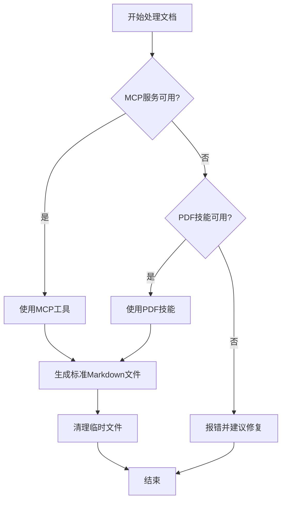

# 文档处理备用方案

**版本**: 1.0
**状态**: 生效中
**最后更新**: 2025-11-20

## 🎯 使用场景

当以下情况发生时，使用本备用方案：

1. **MCP服务不可用**
   - mineru MCP服务未正确启动
   - mineru MCP服务崩溃或无响应
   - 网络连接问题导致远程API无法访问

2. **MCP配置错误**
   - `.claude/mcp.json` 配置文件损坏
   - API密钥无效或过期
   - 可执行文件路径错误

3. **系统环境问题**
   - Python环境不兼容
   - 依赖包缺失或版本冲突

## 🔧 备用方案：PDF技能

### 使用条件

在以下情况下优先使用PDF技能：
- ✅ **MCP服务不可用时**
- ✅ **MCP配置错误时**
- ✅ **简单文档处理时**
- ❌ **复杂文档需要高级OCR时不推荐**

### 调用方式

**通过Claude Code技能调用**：

```bash
# 使用pdf技能处理文档
skill pdf --input "document.pdf" --output "document.md"
```

**在对话中直接调用**：

```
用户：请使用pdf技能解析这个文档
系统：调用pdf技能进行处理
```

### PDF技能配置

**技能路径**：
- 主技能：`pdf`
- 备用技能：`docx`, `xlsx`

**输出规范**：
- ✅ **生成同名Markdown文件**
- ✅ **只包含结构化信息**
- ❌ **不要包含原始OCR文本**
- ❌ **不要生成额外格式文件**

## 📋 处理流程

### 1. 检测阶段



### 2. MCP优先原则

**处理顺序**：
1. **首先尝试**：mineru MCP工具
2. **其次使用**：PDF技能
3. **最后报错**：MCP不可用且技能不可用时

### 3. 错误处理

**MCP失败处理**：
```
检测到mineru MCP不可用，切换到PDF技能处理...
使用PDF技能解析文档...
```

**技能失败处理**：
```
MCP服务和PDF技能均不可用，请检查：
1. mineru MCP配置 (.claude/mcp.json)
2. Python环境和依赖包
3. 网络连接状态
```

## 📁 输出文件规范

### 统一输出标准

无论使用MCP还是技能，输出文件规范保持一致：

**文件位置**：
- 输入：`document.pdf`
- 输出：`document.md`（同目录，同名）

**文件内容**：
```markdown
# [文件名] 解析结果

## 关键信息提取
- 字段1: 值1
- 字段2: 值2
- ...（结构化信息）
```

### 技能输出配置

**PDF技能输出参数**：
```json
{
  "output_format": "markdown",
  "extract_structured": true,
  "include_original_text": false,
  "generate_single_file": true,
  "output_directory": "same_as_input"
}
```

## ⚙️ 配置文件更新

### 系统配置文件

**更新 `.claude/memory/fallback.json`**：

```json
{
  "document_processing": {
    "primary": "mcp.mineru",
    "fallback": "skill.pdf",
    "fallback_enabled": true,
    "auto_switch": true,
    "error_reporting": true
  },
  "skills": {
    "pdf": {
      "priority": 2,
      "enabled": true,
      "config": {
        "output_format": "markdown",
        "structured_only": true
      }
    }
  }
}
```

### Agent配置更新

**DocAnalyzer Agent配置更新**：

```markdown
## 文档处理流程

1. **检测MCP服务状态**
2. **优先使用mineru MCP**
3. **备用PDF技能处理**
4. **统一输出规范**

## 备用方案启用条件
- mineru MCP不可用
- 网络连接问题
- 配置文件损坏
- 服务响应超时
```

## 🔍 故障排查

### 常见问题

**MCP问题**：
```bash
# 检查MCP配置
cat ~/.claude/mcp.json

# 检查mineru安装
which mineru-mcp

# 检查API密钥
echo $MINERU_API_KEY
```

**技能问题**：
```bash
# 检查技能可用性
skill pdf --help

# 测试简单文档处理
echo "test" | skill pdf
```

### 诊断脚本

**创建诊断脚本**：`scripts/diagnose_document_processing.py`

```python
#!/usr/bin/env python3
import subprocess
import os
import json

def check_mcp():
    """检查MCP服务状态"""
    try:
        config_path = os.path.expanduser("~/.claude/mcp.json")
        if os.path.exists(config_path):
            with open(config_path) as f:
                config = json.load(f)
            return "mineru" in config.get("mcpServers", {})
    except:
        return False

def check_pdf_skill():
    """检查PDF技能可用性"""
    try:
        result = subprocess.run(["skill", "pdf", "--help"],
                              capture_output=True, text=True)
        return result.returncode == 0
    except:
        return False

def main():
    mcp_available = check_mcp()
    skill_available = check_pdf_skill()

    print("=== 文档处理诊断报告 ===")
    print(f"MCP服务可用: {'✅' if mcp_available else '❌'}")
    print(f"PDF技能可用: {'✅' if skill_available else '❌'}")

    if not mcp_available and skill_available:
        print("📋 建议使用PDF技能作为备用方案")
    elif not mcp_available and not skill_available:
        print("❌ 文档处理功能不可用，请修复配置")

if __name__ == "__main__":
    main()
```

## 📞 支持文档

**相关文档**：
- [文档处理强制规范](./DOCUMENT_PROCESSING_STANDARDS.md)
- [MinerU MCP配置](../mcp/mineru/README.md)
- [系统架构文档](../../../docs/ARCHITECTURE.md)

**配置文件**：
- 主配置：`.claude/mcp.json`
- 备用配置：`.claude/memory/fallback.json`
- Agent配置：`.claude/agents/DocAnalyzer.md`

---

**注**：本备用方案确保在MCP服务不可用时，系统仍能提供基本的文档处理功能。