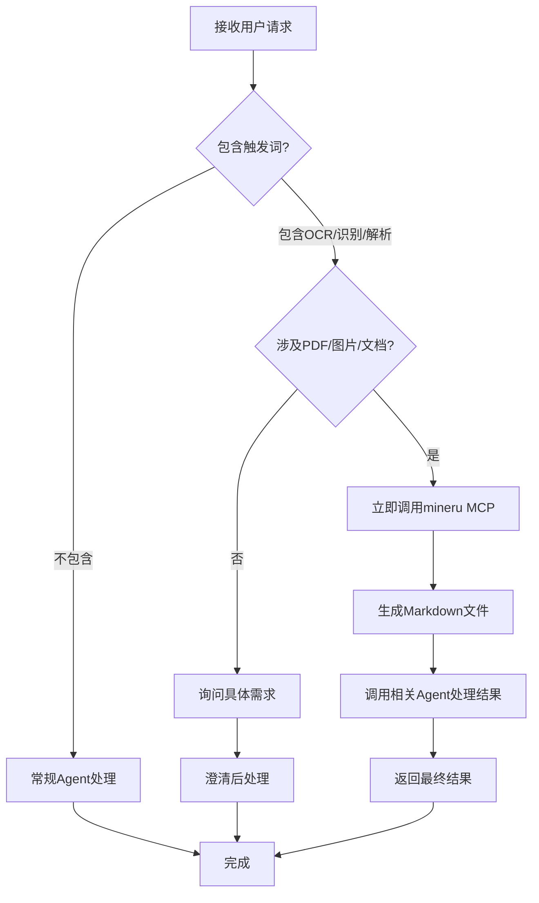

# MCP工具触发词识别规范

**版本**: 1.0
**状态**: 生效中
**最后更新**: 2025-11-20

## 🎯 问题概述

当前Agent系统存在识别问题：
- 用户使用"OCR"、"识别"、"解析"等关键词时，Agent无法正确触发对应的MCP工具
- 使用subagent时，仍然不会调用MCP工具
- 缺乏明确的触发词识别机制

## 📋 核心触发词规范

### 🖼️ PDF/图片OCR识别场景

**直接触发词**：
- ✅ "OCR" - 直接触发mineru MCP
- ✅ "识别" - 当涉及PDF/图片时触发
- ✅ "解析" - 当涉及PDF/图片时触发
- ✅ "提取文字" - 触发mineru MCP
- ✅ "文字识别" - 触发mineru MCP
- ✅ "图片转文字" - 触发mineru MCP

**组合触发词**：
- ✅ "PDF OCR"
- ✅ "图片识别"
- ✅ "文档解析"
- ✅ "扫描件识别"
- ✅ "身份证识别"
- ✅ "营业执照识别"

**上下文触发**：
```
用户：我有一个PDF文件，需要OCR识别
系统：立即调用mineru.parse_documents()

用户：这个图片需要识别一下文字
系统：立即调用mineru.parse_documents()

用户：请解析这个身份证PDF
系统：立即调用mineru.parse_documents()
```

### 📄 文档处理场景

**法律文档特定触发**：
- ✅ "起诉状分析" → DocAnalyzer + mineru MCP
- ✅ "证据材料处理" → DocAnalyzer + mineru MCP
- ✅ "庭审笔录识别" → DocAnalyzer + mineru MCP
- ✅ "判决书解析" → DocAnalyzer + mineru MCP

**通用文档处理**：
- ✅ "分析这个PDF"
- ✅ "处理这个扫描件"
- ✅ "提取文档内容"

## 🔧 Agent响应规范

### 立即响应原则

当检测到触发词时，Agent必须立即采取以下步骤：

1. **识别触发词**
   - 检测到OCR/识别/解析关键词
   - 确认涉及PDF/图片/文档

2. **选择MCP工具**
   ```python
   if "OCR" or "识别" or "解析" in user_query:
       if "PDF" or "图片" or "文档" in context:
           # 立即调用mineru MCP
           call_mcp_tool("parse_documents")
   ```

3. **直接调用MCP**
   - **不要先分析再决定**
   - **不要询问是否需要**
   - **直接调用相应工具**

### 🚫 禁止行为

**严禁以下行为**：
- ❌ 询问用户"您想要我做什么？"
- ❌ 要求用户提供"更具体的要求"
- ❌ 绕过MCP直接使用其他工具
- ❌ 先写分析报告再处理文档
- ❌ 调用subagent但不传递MCP调用指令

### ✅ 正确行为

**必须遵循**：
- ✅ **立即识别触发词**
- ✅ **直接调用MCP工具**
- ✅ **先处理后分析**
- ✅ **处理完成后提供结果**

## 📞 具体场景示例

### 场景1：用户说"我需要OCR"

```bash
用户：我需要OCR这个身份证PDF
错误响应：
❌ "好的，请问您希望我分析身份证的哪些信息？"

正确响应：
✅ 立即调用 mineru.parse_documents(input_file, enable_ocr=true)
✅ 生成 结构化的身份证信息Markdown文件
✅ 完成后报告：已生成张敏娟 身份证.md，包含姓名、性别、身份证号等信息
```

### 场景2：用户说"识别这个图片"

```bash
用户：请识别这个营业执照图片
错误响应：
❌ "我可以帮您分析营业执照，请告诉我您关心的方面"

正确响应：
✅ 立即调用 mineru.parse_documents(input_file, enable_ocr=true)
✅ 生成结构化的营业执照信息Markdown文件
✅ 完成后报告：已生成营业执照.md，包含公司名称、法人、注册信息等
```

### 场景3：用户说"解析这个文档"

```bash
用户：请解析这个起诉状PDF
错误响应：
❌ 调用subagent但不指定MCP工具

正确响应：
✅ 立即调用 mineru.parse_documents(input_file, enable_ocr=true)
✅ 根据解析结果调用IssueIdentifier
✅ 生成完整的案件分析报告
```

## 🔄 响应流程图



## ⚙️ Agent配置更新

### 主Agent配置

**在CLAUDE.md中添加**：

```markdown
## 🎯 MCP工具自动触发

### OCR识别场景
当用户使用以下关键词时，立即调用mineru MCP：
- "OCR"、"识别"、"解析"
- "提取文字"、"文字识别"
- "图片转文字"、"扫描件识别"

### 处理原则
- 立即识别触发词
- 直接调用MCP工具
- 先处理后分析
- 不要询问具体需求
```

### DocAnalyzer Agent配置

**添加触发词识别模块**：

```markdown
## 触发词检测

### 必须立即响应的词汇
- OCR → 立即调用mineru.parse_documents()
- 识别 → 立即调用mineru.parse_documents()
- 解析 → 立即调用mineru.parse_documents()
- 提取文字 → 立即调用mineru.parse_documents()

### 响应流程
1. 检测到触发词 → 2. 确认文档类型 → 3. 调用MCP → 4. 处理结果 → 5. 完成
```

## 📋 质量检查清单

每次用户请求后检查：

**触发词检测**：
- [ ] 是否检测到OCR/识别/解析关键词
- [ ] 是否涉及PDF/图片/文档
- [ ] 是否立即调用MCP工具

**响应质量**：
- [ ] 没有不必要的询问
- [ ] 没有绕过MCP的处理
- [ ] 生成了正确的Markdown文件
- [ ] 返回了完整的结果

**流程合规**：
- [ ] 遵循了"先处理，后分析"原则
- [ ] 没有使用错误的subagent
- [ ] 没有编写Python脚本绕过MCP

## 🚫 违规后果

**违规行为**：
- 不识别触发词直接询问
- 绕过MCP使用其他工具
- 调用subagent但不传递MCP指令
- 生成多余格式的文件

**处理措施**：
1. 立即停止错误处理
2. 重新按正确流程执行
3. 记录违规行为
4. 更新Agent配置避免重复

## 📚 相关文档

- [文档处理强制规范](./DOCUMENT_PROCESSING_STANDARDS.md)
- [文档处理备用方案](./DOCUMENT_PROCESSING_FALLBACK.md)
- [MinerU MCP配置](../mcp/mineru/README.md)
- [系统架构文档](../../../docs/ARCHITECTURE.md)

---

**注**：本规范旨在确保MCP工具的即时响应和正确调用，避免用户因触发词识别问题而无法获得预期服务。