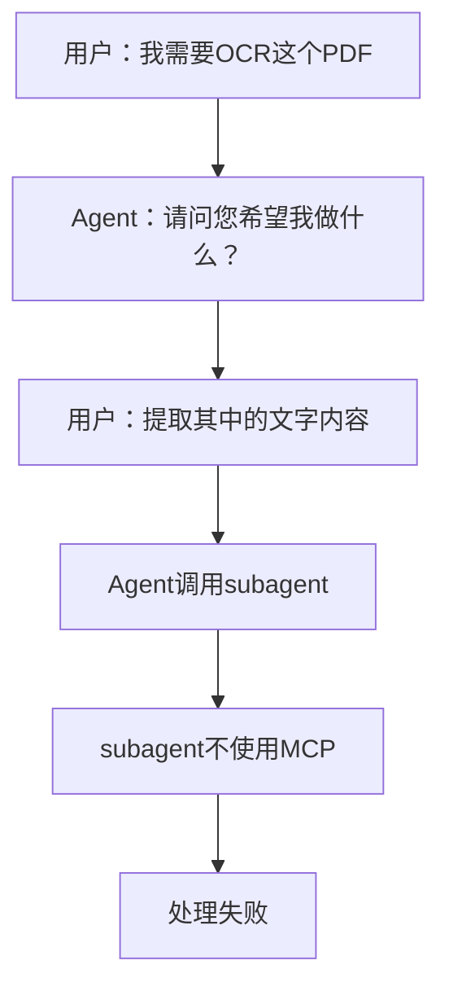

# 响应式Agent调用机制

**版本**: 1.0
**状态**: 生效中
**最后更新**: 2025-11-20

## 🎯 问题核心

用户反馈的关键问题：
- 使用"OCR"、"识别"、"解析"等关键词时，Agent无法正确触发对应的MCP工具
- 使用subagent时，仍然不会使用MCP
- 缺乏明确的触发词识别和响应机制

## 🔧 解决方案

### 1. 立即响应机制

**核心原则**：
- **先处理，后分析**
- **立即识别触发词**
- **直接调用MCP工具**
- **避免反问用户**

### 2. 触发词检测逻辑

**Python伪代码示例**：
```python
def detect_mcp_trigger(user_query, context):
    """检测是否需要调用MCP工具"""

    trigger_words = ["OCR", "识别", "解析", "提取文字", "文字识别"]
    document_types = ["PDF", "图片", "扫描件", "身份证", "营业执照", "起诉状"]

    # 检测触发词
    has_trigger = any(word in user_query for word in trigger_words)

    # 检测文档类型
    has_document = any(doc_type in user_query or doc_type in str(context)
                      for doc_type in document_types)

    return has_trigger and has_document

def auto_response(user_query, context):
    """自动响应机制"""

    if detect_mcp_trigger(user_query, context):
        # 立即调用MCP工具
        call_mineru_mcp(context['file_path'])
        return True
    else:
        return False
```

### 3. Agent调用链优化

**当前问题**：
```
用户请求 → Agent分析 → 调用subagent → subagent不使用MCP → 失败
```

**优化后流程**：
```
用户请求 → 检测触发词 → 直接调用MCP → 处理结果 → 调用Agent分析结果 → 完成
```

## 📋 实现规范

### 主Agent响应规范

**必须执行的步骤**：

1. **接收用户请求**
2. **立即检测触发词**
   - 检查是否包含：OCR、识别、解析、提取文字等
   - 检查上下文是否包含：PDF、图片、扫描件等文档类型
3. **如果有触发词**：
   - 立即调用 `mineru.parse_documents()`
   - 不要询问用户具体需求
   - 不要先写分析报告
4. **MCP处理完成后**：
   - 生成标准Markdown文件
   - 根据需要调用其他Agent处理结果
   - 返回完整结果

### SubAgent调用规范

**改进的SubAgent调用**：

```python
def call_subagent_with_mcp(agent_type, user_query, context):
    """调用SubAgent并传递MCP指令"""

    prompt = f"""
    用户请求：{user_query}

    🚨 重要：用户使用了OCR/识别/解析触发词，必须立即调用MCP工具！

    执行步骤：
    1. 检测到触发词：{detect_trigger_words(user_query)}
    2. 立即调用：mineru.parse_documents()
    3. 不要询问用户，直接处理
    4. 生成Markdown文件
    5. 完成{agent_type}的核心任务

    文档上下文：{context}
    """

    return Task(subagent_type=agent_type, prompt=prompt)
```

## 🔄 处理流程对比

### ❌ 错误流程


### ✅ 正确流程
```mermaid
flowchart TD
    A[用户：我需要OCR这个PDF] --> B[检测到触发词"OCR"和"PDF"]
    B --> C[立即调用 mineru.parse_documents()]
    C --> D[生成Markdown文件]
    D --> E[返回处理结果]
    E --> F[完成]
```

## 📊 配置更新

### 1. 环境变量配置

```bash
# 添加到系统环境
export MCP_AUTO_TRIGGER=true
export MCP_TRIGGER_WORDS="OCR,识别,解析,提取文字,文字识别"
export MCP_DOCUMENT_TYPES="PDF,图片,扫描件,身份证,营业执照"
```

### 2. 配置文件更新

**更新 `.claude/config.json`**：
```json
{
  "mcp_auto_trigger": {
    "enabled": true,
    "trigger_words": ["OCR", "识别", "解析", "提取文字", "文字识别"],
    "document_types": ["PDF", "图片", "扫描件", "身份证", "营业执照"],
    "response_mode": "immediate",
    "skip_user_confirmation": true
  }
}
```

### 3. Agent配置更新

**每个Agent配置中添加**：
```markdown
## MCP自动响应

### 触发词检测
当用户请求包含以下词汇时，必须立即调用MCP工具：
- OCR → mineru.parse_documents()
- 识别 → mineru.parse_documents()
- 解析 → mineru.parse_documents()

### 处理原则
1. 立即检测触发词
2. 不要询问用户
3. 直接调用MCP工具
4. 先处理，后分析
```

## 🎯 具体实现

### 主系统层面

**在Claude Code主指令中添加**：
```
当检测到用户使用OCR、识别、解析等关键词时：
1. 立即调用mineru.parse_documents()
2. 不要询问具体需求
3. 直接处理文档
4. 生成结果文件
```

### Agent层面

**每个Agent的prompt中添加**：
```
🚨 MCP自动触发规则：

如果用户请求包含以下任一关键词：
- "OCR"、"识别"、"解析"、"提取文字"、"文字识别"

必须立即执行：
1. 调用mineru.parse_documents()工具
2. 不要询问用户具体需求
3. 不要先写分析报告
4. 直接处理文档生成Markdown文件
5. 然后执行Agent的核心任务
```

## 📋 测试用例

### 测试场景1：OCR触发
```
用户：我需要OCR这个身份证PDF
期望：立即调用mineru.parse_documents()处理
```

### 测试场景2：识别触发
```
用户：请识别这个营业执照图片
期望：立即调用mineru.parse_documents()处理
```

### 测试场景3：解析触发
```
用户：解析这个起诉状文档
期望：立即调用mineru.parse_documents()处理
```

### 测试场景4：SubAgent调用
```
用户：使用DocAgent分析这个合同PDF
期望：DocAgent检测到"分析"和"PDF"，立即调用MCP工具
```

## 🚫 违规处理

**违规行为**：
- 检测到触发词但不调用MCP
- 询问用户具体需求
- 先写分析报告再处理
- 调用subagent但不传递MCP指令

**纠正措施**：
1. 立即停止当前处理
2. 按正确流程重新执行
3. 记录违规情况
4. 更新配置避免重复

## 📚 相关文档

- [MCP触发词识别规范](./MCP_TRIGGER_PATTERNS.md)
- [文档处理强制规范](./DOCUMENT_PROCESSING_STANDARDS.md)
- [文档处理备用方案](./DOCUMENT_PROCESSING_FALLBACK.md)
- [系统架构文档](../../../docs/ARCHITECTURE.md)

---

**注**：本机制旨在解决用户反馈的核心问题，确保MCP工具的即时响应和正确调用。