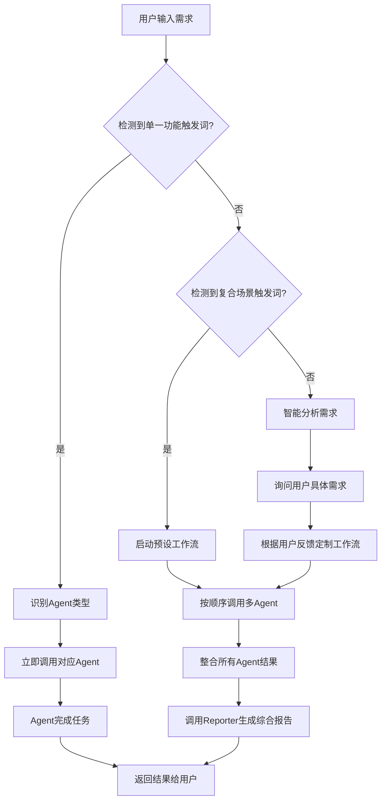

# 主Agent路由配置

**版本**: 1.0
**最后更新**: 2025-11-21
**说明**: 定义用户需求识别和Agent自动路由机制

## 路由机制概述

主Agent在接收到用户需求时，应首先进行需求分析，判断是单一功能需求还是复合工作流需求：

- **单一功能需求**: 直接路由到对应专门Agent
- **复合工作流需求**: 制定工作流组合，按顺序调用多个Agent

## 立即路由规则表

### 📝 Writer Agent - 文书起草
**触发关键词**:
- "写起诉状"、"起草起诉状"
- "写答辩状"、"起草答辩状"
- "写代理词"、"起草代理词"
- "写上诉状"、"起草上诉状"
- "写申请书"、"起草申请书"
- "写质证意见"、"起草质证意见"
- "写法律意见书"、"起草法律意见书"
- "写证据目录"、"制作证据目录"
- "写委托合同"、"起草委托合同"
- "写授权委托书"、"起草授权委托书"
- "写谈话笔录"、"起草谈话笔录"
- "写催款函"、"起草催款函"
- "写法律文书"、"起草法律文书"

**路由规则**: 检测到上述任一关键词 → 立即调用Writer Agent

---

### 🔍 Researcher Agent - 法律研究
**触发关键词**:
- "法律研究"、"法理研究"
- "找法条"、"查法条"、"检索法条"
- "找判例"、"查判例"、"检索判例"
- "司法解释"、"法律适用"
- "相关法规"、"适用法律"
- "法律条文"、"法条解读"
- "案例分析"、"案例检索"
- "法律规定"、"法律依据"

**路由规则**: 检测到上述任一关键词 → 立即调用Researcher Agent

---

### 📄 DocAnalyzer Agent - 文档分析
**触发关键词**:
- "OCR"、"识别"、"解析"
- "分析文档"、"文档分析"
- "提取信息"、"信息提取"
- "处理PDF"、"PDF处理"
- "扫描件"、"图片识别"
- "合同分析"、"协议分析"
- "文档智能分析"、"智能分析"

**路由规则**: 检测到上述任一关键词 → 立即调用DocAnalyzer Agent

---

### ⚖️ EvidenceAnalyzer Agent - 证据分析
**触发关键词**:
- "证据分析"、"证据质证"
- "证据目录"、"证据清单"
- "质证意见"、"质证书"
- "证据审查"、"证据评估"
- "补充证据"、"证据不足"
- "证据链"、"证据收集"

**路由规则**: 检测到上述任一关键词 → 立即调用EvidenceAnalyzer Agent

---

### 🎯 IssueIdentifier Agent - 争议识别
**触发关键词**:
- "争议焦点"、"识别争议"
- "争议点"、"争议分析"
- "法律争议"、"核心争议"
- "案件争议"、"争议问题"
- "确定争议"、"梳理争议"

**路由规则**: 检测到上述任一关键词 → 立即调用IssueIdentifier Agent

---

### 🧠 Strategist Agent - 策略分析
**触发关键词**:
- "策略分析"、"分析策略"
- "诉讼策略"、"案件策略"
- "风险评估"、"风险分析"
- "策略制定"、"制定策略"
- "可行性分析"、"胜诉可能性"
- "案件评估"、"策略建议"
- "制定方案"、"诉讼方案"

**路由规则**: 检测到上述任一关键词 → 立即调用Strategist Agent

---

### 📊 Summarizer Agent - 摘要生成
**触发关键词**:
- "生成摘要"、"案件摘要"
- "简报"、"汇报摘要"
- "总结"、"归纳"
- "案情概要"、"案件概要"
- "风险摘要"、"策略摘要"
- "客户汇报"、"工作汇报"

**路由规则**: 检测到上述任一关键词 → 立即调用Summarizer Agent

---

### 🕐 Scheduler Agent - 日程管理
**触发关键词**:
- "期限管理"、"时间管理"
- "日程安排"、"案件时间线"
- "工时统计"、"工作时间"
- "案件期限"、"诉讼时效"
- "开庭时间"、"立案时间"

**路由规则**: 检测到上述任一关键词 → 立即调用Scheduler Agent

---

## 复合工作流识别规则

### 🚨 常见场景自动识别

**场景1: 收到起诉状（被告应诉）**
**触发词**: "收到起诉状"、"需要应诉"、"准备答辩"
**工作流**: DocAnalyzer → IssueIdentifier → Researcher → Strategist → Writer → Reporter

**场景2: 新证据质证**
**触发词**: "新证据"、"证据质证"、"证据审查"
**工作流**: DocAnalyzer → EvidenceAnalyzer → Researcher → Writer → Summarizer

**场景3: 庭审后分析**
**触发词**: "庭审结束"、"分析庭审"、"调整策略"
**工作流**: DocAnalyzer → EvidenceAnalyzer → Strategist → Summarizer → Reporter

**场景4: 判决分析**
**触发词**: "收到判决"、"判决分析"、"上诉分析"
**工作流**: DocAnalyzer → IssueIdentifier → Researcher(上诉可行性) → Strategist → Summarizer

**场景5: 原告起诉**
**触发词**: "准备起诉"、"委托起诉"、"需要起诉状"
**工作流**: DocAnalyzer → IssueIdentifier → Researcher → EvidenceAnalyzer → Writer → Summarizer → Reporter

**场景6: 制作委托材料**
**触发词**: "确定委托"、"签署委托"、"办理委托"
**工作流**: DocAnalyzer → Writer(委托材料包) → Summarizer → Reporter

## 路由执行流程

### 主Agent路由决策树



### 路由优先级规则

1. **关键词匹配优先**: 精确匹配触发词 → 立即路由
2. **场景识别优先**: 匹配复合场景 → 启动预设工作流
3. **智能分析最后**: 无法自动识别 → 询问用户并智能分析

## Agent调用标准

### 单一任务调用模式
```
用户: "写起诉状"
主Agent: 检测到"写起诉状" → 路由到Writer Agent
Writer Agent: 完成起诉状起草 → 返回结果
主Agent: 将结果返回用户
```

### 复合任务调用模式
```
用户: "收到起诉状需要应诉"
主Agent: 检测到复合场景 → 启动预设工作流
主Agent: 按顺序调用 Agent1 → Agent2 → Agent3...
Reporter Agent: 整合所有结果 → 生成综合报告
主Agent: 将最终报告返回用户
```

## 配置维护说明

### 更新频率
- **触发词库**: 每月评估和补充新关键词
- **工作流模板**: 根据用户反馈优化流程
- **路由规则**: 根据系统使用情况调整优先级

### 质量监控
- 记录路由准确率和用户满意度
- 监控Agent响应时间和处理质量
- 收集用户反馈持续优化路由机制

## 异常处理

### 无法识别需求
- 保持当前交互模式，由主Agent直接处理
- 询问用户具体需求，手动选择合适的Agent
- 记录无法识别的词汇，用于优化触发词库

### Agent调用失败
- 自动尝试调用备用Agent或回退到主Agent处理
- 记录失败原因，用于系统优化
- 向用户说明情况并提供替代方案

---

**重要提醒**: 本路由配置的核心目标是实现用户需求的精准识别和快速路由，确保每个需求都能由最合适的专业Agent来处理，提升系统的响应速度和专业化水平。---
description: "SuitAgent工作流配置 - 自动化工作流定义和执行原则"
category: "workflow"
version: "1.0"
---
# SuitAgent 工作流配置

本文件定义了SuitAgent系统的完整工作流配置，包括7个核心场景的自动化工作流模板。

## 工作流模板

### 场景1：被告应诉

**名称**：被告应诉
**描述**：收到起诉状时的完整应诉流程

**触发关键词**：

- "收到起诉状"
- "需要应诉"
- "准备答辩"

**工作流步骤**：

1. **DocAnalyzer** (分析起诉状) → [内嵌验证]
2. **IssueIdentifier** (识别争议焦点) → [内嵌验证]
3. **Researcher** (法律检索) → [内嵌验证]
4. **Strategist** (制定应诉策略) → [专项审查]
5. **Writer** (起草答辩状) → [专项审查]
6. **Reviewer** (自动触发，质量审查) → [跨Agent质量把关]
7. **Summarizer** (生成摘要) → [内嵌验证]
8. **Reporter** (整合报告) → [最终审查]

**预期输出**：

- ✅ 争议焦点分析
- ✅ 法律检索报告
- ✅ 应诉策略方案
- ✅ 答辩状草稿
- ✅ 证据清单
- ✅ 完整案件报告

### 场景2：新证据质证

**名称**：新证据质证
**描述**：收到新证据时的质证分析流程

**触发关键词**：

- "有新证据"
- "需要质证"
- "证据审查"

**工作流步骤**：

1. **DocAnalyzer** (分析新证据)
2. **EvidenceAnalyzer** (证据分析)
3. **Researcher** (针对性法条研究)
4. **Writer** (质证意见书)
5. **Summarizer** (证据摘要)

### 场景3：庭审后分析

**名称**：庭审后分析
**描述**：庭审结束后的分析与策略调整

**触发关键词**：

- "庭审结束"
- "分析庭审"
- "调整策略"

**工作流步骤**：

1. **DocAnalyzer** (庭审笔录分析)
2. **EvidenceAnalyzer** (对比前后证据)
3. **Strategist** (调整策略)
4. **Summarizer** (庭审摘要)
5. **Reporter** (阶段报告)

### 场景4：法律服务方案

**名称**：法律服务方案
**描述**：诉前沟通时的服务方案制定

**触发关键词**：

- "客户咨询"
- "初步沟通"
- "需要服务方案"

**工作流步骤**：

1. **DocAnalyzer** (沟通记录分析)
2. **IssueIdentifier** (识别客户需求)
3. **Strategist** (制定服务方案)
4. **Writer** (生成法律服务方案书)
5. **Summarizer** (方案摘要)

**预期输出**：

- ✅ 客户需求分析
- ✅ 法律风险评估
- ✅ 服务方案建议
- ✅ 费用预算估算
- ✅ 时间进度安排

### 场景5：策略优化

**名称**：策略优化
**描述**：诉讼过程中的策略调整和优化

**触发关键词**：

- "客户反馈新情况"
- "需要调整策略"
- "优化证据目录"

**工作流步骤**：

1. **DocAnalyzer** (沟通记录分析)
2. **EvidenceAnalyzer** (优化证据目录)
3. **Strategist** (调整诉讼策略)
4. **Reporter** (更新方案)

**预期输出**：

- ✅ 新情况分析
- ✅ 证据目录优化
- ✅ 策略调整建议
- ✅ 风险点提醒

### 场景6：原告起诉

**名称**：原告起诉
**描述**：完整起诉流程，从材料分析到起诉包生成

**触发关键词**：

- "准备起诉"
- "委托起诉"
- "需要起诉状"

**工作流步骤**：

1. **DocAnalyzer** (案件材料分析)
2. **IssueIdentifier** (识别争议焦点)
3. **Researcher** (法律检索)
4. **EvidenceAnalyzer** (证据分析)
5. **Writer** (起草起诉状)
6. **Writer** (制作证据目录)
7. **Summarizer** (案件摘要)
8. **Reporter** (整合完整起诉包)

**预期输出**：

- ✅ 案件争议焦点分析
- ✅ 法律检索报告
- ✅ 起诉状草稿
- ✅ 证据目录
- ✅ 案件分析摘要
- ✅ 完整起诉材料包

### 场景7：制作委托材料

**名称**：制作委托材料
**描述**：正式委托时的委托文件生成

**触发关键词**：

- "确定委托"
- "签署委托"
- "办理委托"

**工作流步骤**：

1. **DocAnalyzer** (客户信息确认)
2. **Writer** (生成委托文件)
   - 002律师服务质量监督卡存根.docx
   - 003谈话笔录.docx
   - 004委托代理合同.docx
   - 005授权委托书(公司/个人).docx
   - 007法律文书送达地确认书.docx
3. **Summarizer** (委托清单摘要)
4. **Reporter** (整合委托材料包)

**预期输出**：

- ✅ 委托合同（Word格式，标准化合同条款）
- ✅ 授权委托书（Word格式，诉讼代理授权）
- ✅ 谈话笔录（Word格式，客户需求确认）
- ✅ 律师服务质量监督卡（Word格式）
- ✅ 法律文书送达地确认书（Word格式）
- ✅ 委托材料清单
- ✅ 完整委托材料包

**特色功能**：

- 🆕 **自动模板选择**：根据委托类型（公司/个人）自动选择对应模板
- 🆕 **Word格式输出**：保持原始格式，支持表格、样式等
- 🆕 **占位符映射**：自动将YAML字段映射为Word占位符
- 🆕 **批量生成**：一次性生成5个核心委托文件

## 快速启动模板

| 模板                   | 适用场景                   |
| ---------------------- | -------------------------- |
| **初始案件分析** | 接收新案件时的全面分析     |
| **新证据质证**   | 收到新证据，需要质证意见   |
| **答辩意见起草** | 收到起诉状，起草答辩状     |
| **补充证据**     | 识别证据缺口，生成补充清单 |
| **庭审笔录分析** | 庭审后分析，调整策略       |
| **代理词起草**   | 庭前或庭后起草代理词       |
| **案件进展总结** | 阶段性总结汇报             |
| **风险评估报告** | 专门的风险评估             |

## 工作流执行原则

### 核心原则

1. **自动触发机制**
   每个Agent在完成自身工作后，必须自动触发后续Agent，而不是等待手动调用。
2. **上下文继承**
   启用上下文继承，保持分析一致性。
3. **增量更新**
   复用历史分析结果，提高效率。
4. **质量保证**
   每个Agent都具备内嵌验证或专项审查机制。

### 工作流完整性保障

- **自动触发**：✅ 启用
- **上下文维护**：✅ 启用
- **质量检查**：✅ 启用
- **增量支持**：✅ 启用

## 🔄 变更历史

| 版本 | 日期       | 更新内容                                                                              |
| :--- | :--------- | :------------------------------------------------------------------------------------ |
| v1.0 | 2026-01-01 | 迁移到Claude Code Rules架构，从YAML配置文件转换为Markdown格式，保持所有工作流定义不变 |

---

*本文档是SuitAgent系统工作流配置的核心文件，自动加载到项目记忆中。*
